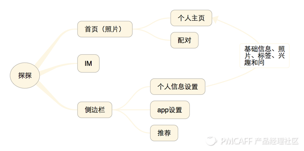
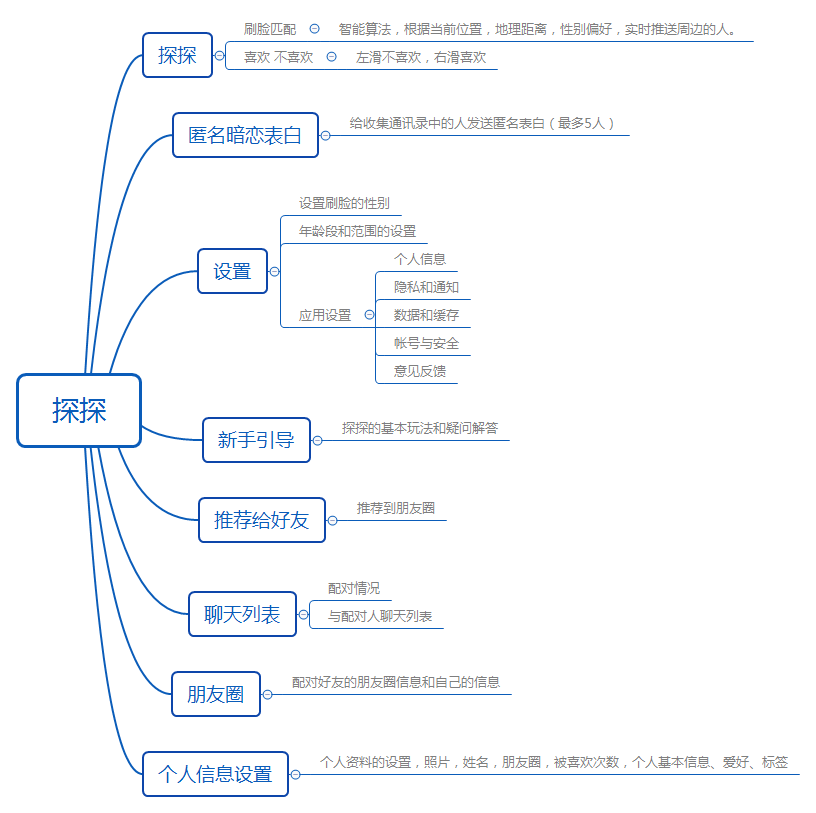

##                                探探产品分析报告

### 一  产品形态

#### 1 概况

​        探探是一个基于大数据智能推荐、全新互动模式的社交App。探探根据用户的个人资料、位置、兴趣爱好等信息，计算并推送身边与你匹配的人，帮助用户结识互有好感的新朋友。探探目前的活跃用户在1646.4万，启动次数为133159万次，使用时长达到了5059.06万时。目前这个数据仍在不断的增长中。

#### 2 产品框架图

### 二   产品分析

#### 1 战略定位

##### 1.1 连接方式的多样化

​        在朋友社交领域，微信占据了移动端朋友之间沟通的绝对地位，QQ占据了PC端好友沟通的绝对地位，在陌生人社交领域，微博占据了社交平台的巨大流量、陌陌也在其中深耕。在互联网之前只限于局部范围内，互联网带来了高速连接，人与人之间的联系被无限拉近，社交也不在只能局限于众多朋友之间，微博、QQ、陌陌等都将众多陌生人拉到了自己身前。

##### 1.2 约会方式的创新

​       探探之前，空虚寂寞的夜晚，单身青年拿手机的姿势是“摇一摇”。认识陌生人和约会还限制于搜索QQ号，摇一摇等基本的“海选”方式上。

​       探探在以上基础上，探索基于“链接陌生新方式”、“社交本质的回归”、“约会同步化”这三个方面的“主动”，开发出了这款产品。基于“主动”出发，从“被动陌生人关注链接”转为了“主动链接喜欢的人”，将用户链接陌生人的成功概率和满意度升高到了高点。

##### 1.3 探探的方向

​        相亲 ，恋爱，约X都是陌生交友约会的解决方式。相亲是高成本的和对未来有高度的不确定性，恋爱也是高成本的投入和精力的付出，未来同样不确定。相比于相亲、恋爱，“约X”是低成本的付出，最低精力消耗。这似乎是一条社交的新道路，探探利用互联网的海量用户规模，煽动能力，充分激发了用户的简单交友、约会的心态，制定了“找生命中的那个人”的伟大愿景。

​       “一见钟情的爱情”是探探的主要思路。通过“刷脸”以最粗暴的方式来双方匹配，高效率低成本的解决男女之间交友的社交之事。从而在中国这个单身男女越来越多的时代背景下，在社交领域分得一杯羹。

#### 2 商业模式

​       国内的主流社交软件盈利的四种模式：广告模式，会员收费模式，增值服务模式，电商购物模式。

​       目前探探还没有类似于以上的收费方式，个人认为探探现在的活跃用户和留存率足够支撑探探在多方面的盈利模式。

​      （1）广告：探探可以利用其高粘着特性，通过自身的用户资源吸引品牌商的广告投放实现盈利相对是最为简单直接；

​      （2）会员：给予高等级VIP会员所独享的更高的权限，比如能看到意向会员更详细的资料及联系方式，可以随意向中意的会员打招呼，发私信，可以看到哪些会员浏览过自己的主页之类的，如果用户的黏着度，留存率够高，这块也是长期稳定的收益；

​      （3）增值服务：付费表情和赠送的虚拟礼品，这块盈利相对于广告来说，比较讨喜，是很自然用户需求的延伸，有需求的用户付费也是自然而然的，但广告相对就会收到用户的厌烦，所以探探也可以在增值服务上实现盈利。

#### 3 用户群体

​        探探的用户主要集中在大四毕业到工作五年这一区间内，其实就是单身白领阶层。其中男性用户的比率为59.36%，女性为40.64%。在所有的活跃用户中，24岁以下的占比20.46%,25岁到30岁的占比为30.98%,31岁到35岁的占比为30.47%,36岁以上的占比18.09%.在活跃用户的地理分布上，超一线城市占比为9.61%，一线城市为42.66%，二线城市占比为20.11%，三线城市占比17.16%。

​        由以上数据可见探探的主要用户群体为一二线城市中30岁左右的单身男女，因为这部分的人群社交需求处于难以被满足的状态，探探想占领的就是这部分领域。

#### 4 关键业务

​        探探的“左滑右滑、互相喜欢才能聊天”的核心产品机制，给年轻人带来有趣、浪漫的独特体验。此外其安全、防骚扰的特点使其成为一款非常受女性受众欢迎的社交应用。

##### 4.1 产品结构图

##### 4.2 社交模式

​        大数据智能推荐用户——探探不仅基于LBS，还会根据用户之间共同兴趣爱好、共同好友、曾经共同经过的地点等十几项信息，计算并推送与之匹配的人。探探维护这个社交规则的机制如下：

​       （1）提高相互选择的效率：相互喜欢即可配对聊天，能看到联系方式的人都是相互喜欢的。平衡了消极力量，提示用户，选择不喜欢时，对方不会收到通知，避免社交中被拒绝的尴尬；

​       （2）通过照片的第一印象快速选择：照片最多可添加6张，载体简单而有效；

​       （3）信息真实：需完善电话、星座等信息，要求用户上传真实的个人照；无个人图片不可进入系统、使用人脸识别来判定真实照片.

##### 4.3 匿名暗恋表白

​        探探不仅在陌生人社交机制上有自己的创新，而且添加了匿名暗恋表白的功能。这个基于双方都在探探这个平台上的通讯录里的人，这样一个应用背景，就结合到了熟人社交，它和推荐给好友正好契合。当用户看到这个功能时，如果自己心里一直有暗恋对象，可以把探探推荐给你的暗恋对象，然后在匿名表白，这样的一个循环逻辑，不仅仅满足了羞涩用户在平时难以开口表白的尴尬，而且还拓展了探探的用户量。

#### 5 UI设计

##### 5.1 核心交互

​        采用左右滑动的方式，符合快速、便捷的使用习惯；页面设置简单，除了喜欢/不喜欢的操作外，卡片内的点击都跳转到用户的个人主页，再次点击返回。用户主观选择上以图片为主，后台算法客观结合匹配程度来推荐，包括LBS、在线状态、兴趣爱好、活跃度等，并在页面上给予提示，辅助用户选择。

​        滑动图片与单纯的信息流相比，在体验上多了一层含义，它带给用户挑选的快感，用户的喜好得到及时输出和表达。联想到古代皇帝翻牌子，为什么是翻，而不是单纯地浏览/随意选取呢？这同样是选择感，是个人表达的仪式化。这样的交互也非常符合产品“快速认识人”的特点，简单方便。

##### 5.2 IM与联系人

​        配对与聊天分为两个Tab，在架构上分别属于联系人和IM页面，但功能区分不明显，点击头像进入个人主页，点击其他区域则进入对话，第二层功能几乎没有区分。所有配对里排列头像、昵称和配对时间（或对话），聊天里则是头像、昵称和最后对话，交互上也相差不大。配对方便以后，联系人获取比其他app要简单，配对时间并不引人注意，联系人这个设置的重要性也随之降低，社交到最后留存率则是比较大的问题。为了促进用户沟通，探探在聊天首页放置用户图片和主要相关信息，但这样的刺激有些单薄。另外，IM的细节上也有挺多可以完善的地方，如私密真心话，应该只能由对方来点击是否同意，发送前先与用户确认；真心话的使用交互可以更加明确等，IM添加更多的功能，如转发、复制等。

#### 5.3 侧边栏

​        从侧边栏的设置来看，第一二行操作都是跳出菜单，个人理解这个用意是希望用户多配对、多聊天，其实没什么卵用，反而使侧边栏作用冗余。产品的前半部分的配对做得很好，交互足以支撑功能。但从用户路径来看，后期的深入了解和沟通，是以左侧用户信息的完善为前提的。中国用户，尤其是女性，更加信任个人资料丰富的人。tinder直接用Facebook账户登录，并使用Facebook的图片和头像，天然距离用户的真实社交圈子更近一步。另外，在个人主页点击返回，是回到侧边栏，右边仍然是个人主页。个人认为侧边栏与个人主页来回切换的操作很少，流程应该简化为直接回到App首页或首页与侧边栏并存。

### 三  总结与建议

​        探探的优势或者是流量就来源于低成本的获取关系，弱势就是没有办法把关系沉淀下来，这也是这个产品的特性。在建立新关系的流程上，探探做了很多优化，是非常优秀的产品。个人仅提出一下几点建议：

​       （1）点错不能重来。左右滑挑选头像时，会有惯性，尤其是滑动频率快的时候，容易划错，喜欢的人滑了无感，后悔不已，无感的滑了喜欢，有点担心。心仪的人滑了之后，如果没有配对上，这辈子就再也找不到了，也是一种很痛苦的体验.      

​       （2）配对率较低。前面已经提到，找一个认可彼此相貌的人成功率是非常低的，虽然探探把挑选成本降到了最低，但用户要想匹配成功，依然要喜欢很多人才行。所以除了头像和共同点外，探探还可以开拓更多的互动场景增加匹配率。探探现在的辅助配对的有星座、籍贯、常出没地、兴趣爱好，个人建议如果在注册探探的时候可以推荐进行人生观、价值观、爱情观的调查问卷，这样对每一个用户都有一个客观的评价，根据这个评价进行配对的成功率可能会提高一些。

​      

​     

